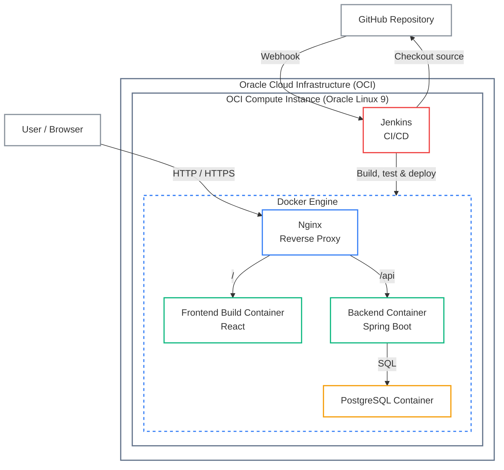
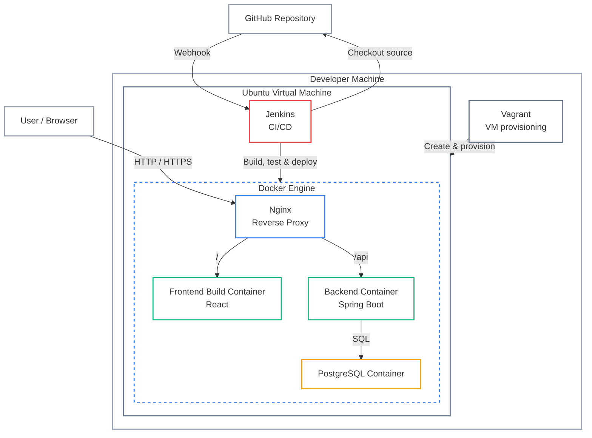

# Infrastructure & Deployment Guide

This document outlines the deployment workflow and infrastructure setup for the Dynamic Rent Adjustment System (DRAS).

## 1. Architecture Diagrams

### Diagram A: Production Deployment Architecture (OCI)

### Diagram B: Local Deployment / Reproducible Environment (Vagrant)

## 2. Prerequisites

To run this application locally without Vagrant, ensure you have the following installed:
- Docker and Docker Compose.
- Git.

## 3. Local Development (Docker)

The application is containerized using Docker and orchestrated with Docker Compose. Nginx acts as a reverse proxy, routing traffic to the frontend and backend containers.
- **Start everything:** Run `docker compose up -d`.
- **Rebuild:** Run `docker compose up -d --build` after adding new dependencies (like npm packages or Maven imports).
- **Stop everything:** Run `docker compose down`.
- **Watch logs:** Run `docker compose logs -f` to see everything, or `docker compose logs -f backend` for just the backend.
- **Access the app:** Navigate to `http://localhost:5173` (or `http://localhost` if using the Nginx reverse proxy).

## 4. Infrastructure Provisioning (Vagrant)

A complete, reproducible infrastructure is provided via Vagrant. The `Vagrantfile` and `bootstrap.sh` automate the setup of an Ubuntu VM containing Java 21, Node.js 20, Docker, Docker Compose, and Jenkins.
- To start the VM and trigger provisioning, run `cd infrastructure/vagrant` followed by `vagrant up`.
- The application will be accessible at `http://localhost:8080` (this is forwarded to the VM's internal Nginx proxy on port 80).
- Jenkins will be accessible at `http://localhost:8888` on your host machine.

## 5. CI/CD Pipeline (Jenkins Setup)

Jenkins automatically handles deployments when you push to GitHub. The project includes a `Jenkinsfile` for CI/CD, containing stages for Backend Build, Backend Tests, Frontend Install, Frontend Build, Docker Image Build, Docker Compose Deployment, Health Check, and Archive Logs.

### Initial Setup (Local Vagrant Environment)
If you are testing the pipeline locally using Vagrant, set up Jenkins as follows:
1. Open your browser and go to `http://localhost:8888`.
2. Retrieve the initial admin password by running `vagrant ssh -c "sudo cat /var/lib/jenkins/secrets/initialAdminPassword"`.
3. Install the suggested plugins and create your admin user.
4. Create a new "Pipeline" project, set "Definition" to "Pipeline script from SCM", point it to your Git repository URL, and set the Script Path to `Jenkinsfile`.
5. To deploy manually, click **Build Now** in your Jenkins pipeline.

### Production Setup (OCI)
In production (Oracle Cloud), Jenkins runs as a native system service on the Ubuntu host (not inside Vagrant or Docker). The setup steps are similar, but you access Jenkins via the server's designated port and retrieve the initial password directly from `/var/lib/jenkins/secrets/initialAdminPassword` on the host.

## 6. Production Management (Oracle Cloud VM)

The production configuration (`docker-compose.prod.yml`) includes restart policies, health checks, named volumes, and log rotation, with Nginx being the only publicly exposed service. Before deploying, you must copy `.env.example` to `.env` and edit it with your credentials.

If you ever need to manually fix things on the production server, SSH in and go to `/opt/dras/repository`.
- **See what's running:** Run `docker compose -f docker-compose.prod.yml ps`.
- **Watch live production logs:** Run `docker compose -f docker-compose.prod.yml logs --tail=100 -f`.
- **Force a manual redeploy from scratch:** If the frontend isn't updating properly, run `docker compose -f docker-compose.prod.yml build`, followed by `docker compose -f docker-compose.prod.yml down --remove-orphans`, optionally `docker volume rm dras_frontend_dist || true`, and finally `docker compose -f docker-compose.prod.yml up -d`.

## 7. Database Backups

There is a backup script located at `infrastructure/scripts/backup-db.sh`.
- It is set up on the Oracle server to run automatically every night at 3:00 AM using a cron job, saving backups to `/opt/dras/backups/`.
- To take a manual backup before doing something risky, run `/opt/dras/repository/infrastructure/scripts/backup-db.sh`.

## 8. Troubleshooting

### General Issues
- **Database Connection Issues:** Ensure your `.env` credentials match the Spring Boot configuration. If using Docker, ensure the `db` service is healthy before `backend` starts.
- **Port Conflicts (Local Only):** If port 8080 or 5432 is already in use on your host machine, modify `docker-compose.yml` or the `Vagrantfile` port forwarding settings. In production, port 8080 is never exposed (only port 80 via Nginx).
- **Nginx 502 Bad Gateway:** Check the backend logs (`docker compose logs backend`). This typically occurs if the Spring Boot application fails to start or is still initializing.

### VirtualBox fails to start with Secure Boot enabled
If `vagrant up` reports that no provider is available or loading the VirtualBox kernel module fails with `Key was rejected by service`, check if the VirtualBox module signing key is enrolled by running `sudo mokutil --test-key /var/lib/shim-signed/mok/MOK.der`.

If it is not enrolled:
1. Run `sudo mokutil --import /var/lib/shim-signed/mok/MOK.der` and choose a temporary password.
2. Reboot, and in the MOK Manager screen, select **Enroll MOK** > **Continue** > **Yes**, enter your password, and **Reboot**.
3. Verify enrollment with the test-key command, load the module with `sudo modprobe vboxdrv`, and start the VM with `vagrant up`.
